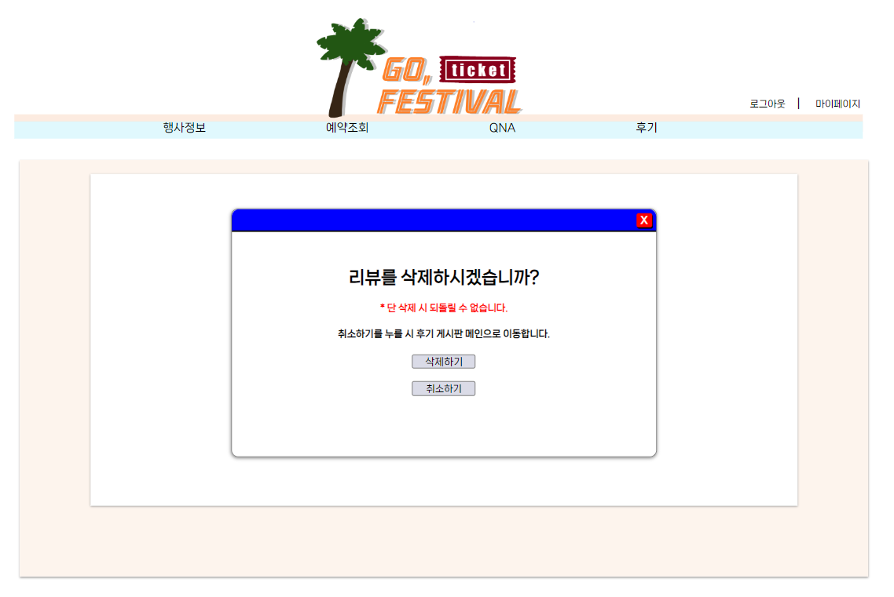

# GO,FESTIVAL

   
  기가막히조의 메인페이지 입니다!
  
   

## 프로젝트 소개

	사이트 별로 찾아보기 힘들었던 축제 정보를 한번에 모아보는 사이트 제작 
	프론트엔트부터 백엔드까지 전반적인 구현 경험 
	각종 게시판과 축제 예약까지 CRUD구현

<a href="https://drive.google.com/file/d/1mG-G1pvNusgcNeo4dG5fRqusZKPWVOaS/view?usp=sharing" >Go, festival 소개 보러가기</a>
   
  

GO, FESTIVAL 메인페이지입니다.

 
 
GO, FESTIVAL 리뷰 작성 페이지입니다.

  

   
  
GO, FESTIVAL 리뷰 상세 페이지입니다.

  

  
  
GO, FESTIVAL 리뷰 수정 페이지입니다.

  

  
  
GO, FESTIVAL 리뷰 삭제 페이지입니다.

  

  

 

## 기술 스택

<h1>📚 STACKS</h1>

 
  

   
  

 

## 구현 기능

### 리뷰 등록
<li>행사별로 리뷰를 등록할 수 있도록 함</li>
 

### 리뷰 검색/조회
<li>행사별로 리뷰를 검색하는 기능을 구현함 
리뷰게시판 메인페이지에서는 목록 전체조회가가능하게 구현함
</li>
 

### 리뷰 수정
<li>작성한 리뷰를 수정할 수 있도록 구현함</li>
 

### 리뷰 삭제
<li>작성한 리뷰를 삭제할 수 있도록 구현함</li>
 

### 리뷰 좋아요
<li>리뷰 별로 좋아요를 누를 수 있도록 구현함</li>
 

### 댓글 등록
<li>리뷰 별로 댓글을 등록할 수 있도록 구현함</li>
 

### 댓글 삭제
<li>작성한 댓글을 비밀번호 확인 후 삭제할 수 있도록 구현함</li>
 

### 댓글 좋아요
<li>댓글 별로 좋아요를 누를 수 있도록 구현함</li>

 

## 배운 점 & 아쉬운 점

개념적으로만 배우던 내용들을 실제로 적용하여 개발하며 기술적으로 많이 성장하는 계기가 되었습니다.
개념적으로 부족했던 부분도 개발하며 많이 깨닫게 되었고, 스스로의 실력을 객관적으로 확인하여 보완할 수 있었습니다.
프로젝트를 진행하며 수많은 에러에 부딪혔었는데, 값의 경로를 잘못 설정하거나 오타를 내서 에러가 난 적이 많았습니다. 프로젝트를 진행하기 전에는 경험해보지 못한 오류들도 많았기에 다양한 유형의 에러를 경험하며 에러를 대처하는 방법에 대해 배울 수 있었고, 에러를 많이 접할 수록 비슷한 에러나 실수는 줄일 수 있게되었습니다.
또, 하나의 웹사이트가 어떤 방식으로 만들어지는 지 그 흐름과 방법에 대해 배울 수 있었고 팀원 간의 협업을 통해 팀원과 소통하는 방법, 함께 프로젝트를 진행하는 방법에 대해서 배울 수 있어 뜻깊은 시간이었습니다.
부족한 부분들에 대해서도 인지하고 보완하기위해 노력하였고, 이번 프로젝트로 배운 것을 토대로 더욱 좋은 프로젝트를 만들 수 있을 것 같습니다.

실제로 배포할 수 있는 사이트를 제작하지 못한 것이 아쉬움이 가장 컸고, 다양한 기술 스택을 사용해보지 못한 것에 대한 아쉬움이 많이 남아있습니다. 다음 프로젝트 때는 다양한 기술 스택을 효과적으로 이용하여 사이트를 제작하고 상용화 하고 싶은 욕심이 있습니다.
/>

 

<!-- Stack Icon Refernces -->

[js]: ./readme-static/img/javascript.svg
[java]: ./readme-static/img/java.svg
