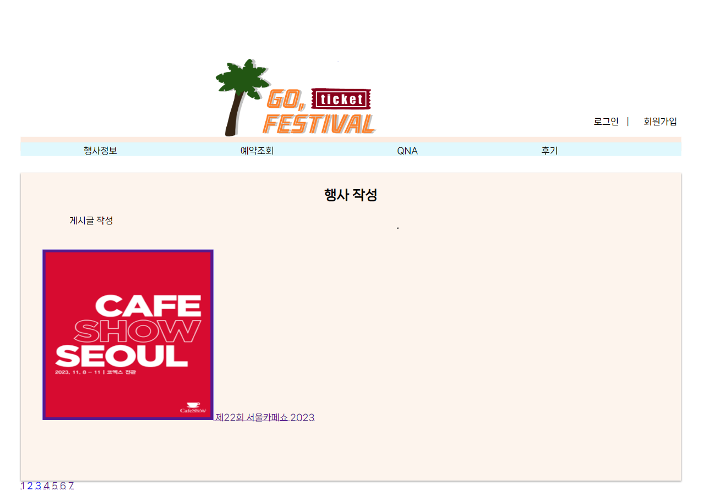
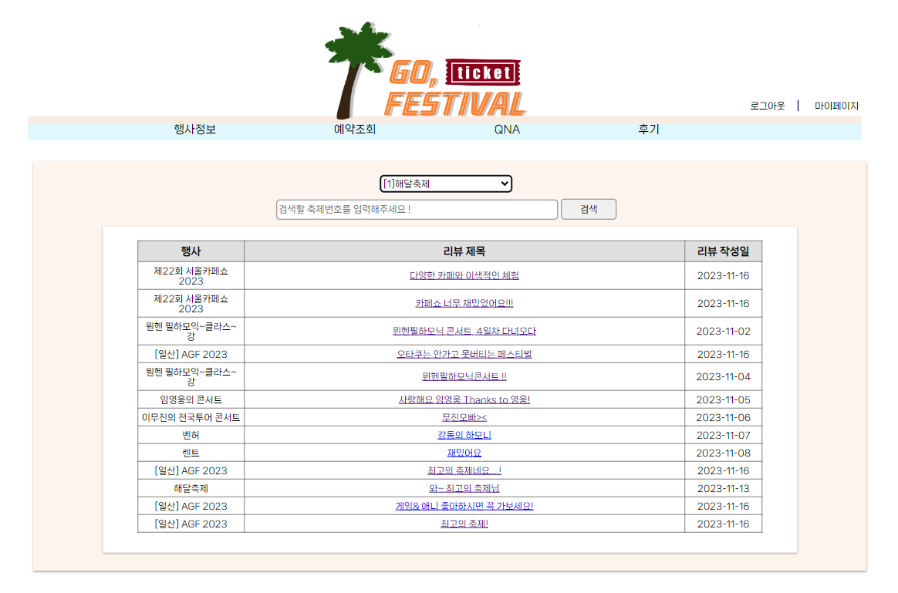
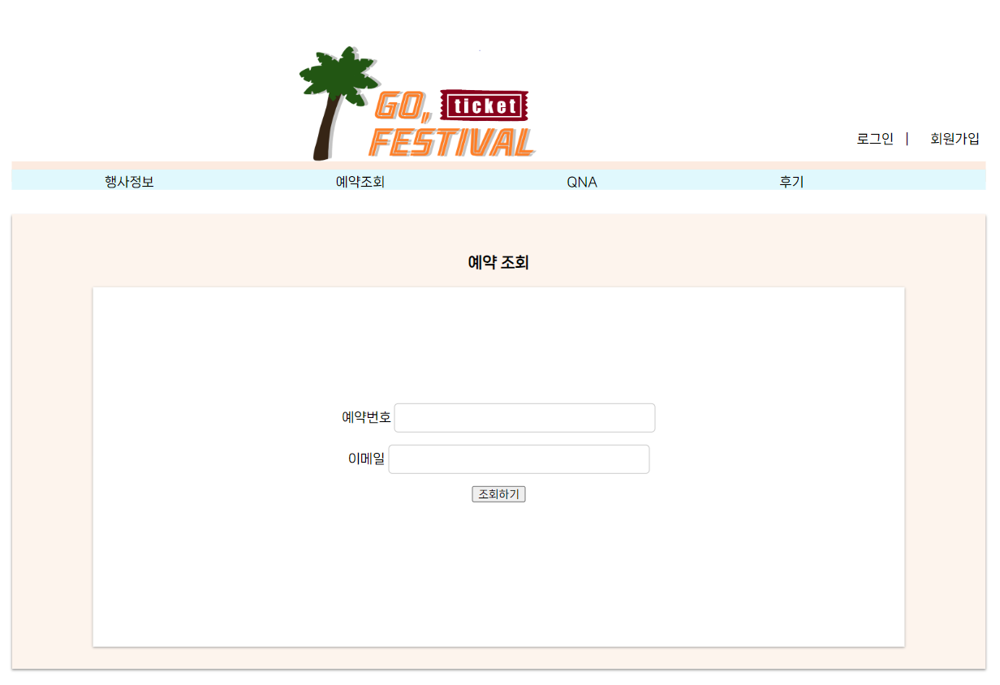

# GO,FESTIVAL

   
  기가막히조의 메인페이지 입니다!
  
   

## 프로젝트 소개

	사이트 별로 찾아보기 힘들었던 축제 정보를 한번에 모아보는 사이트 제작 
	프론트엔트부터 백엔드까지 전반적인 구현 경험 
	각종 게시판과 축제 예약까지 CRUD구현

   
  
GO, FESTIVAL 메인페이지입니다.

  
   
   
GO, FESTIVAL 행사글 작성 페이지입니다.

  
   
   
GO, FESTIVAL 리뷰 게시판 페이지입니다.

  
   
   
GO, FESTIVAL 예약조회 페이지입니다.

  
   
   
GO, FESTIVAL 리뷰 상세내용 페이지입니다.

  
   
   
GO, FESTIVAL 댓글 삭제 확인 페이지입니다.

  
   
  
GO, FESTIVAL 리뷰 작성 페이지입니다.

 

## 기술 스택

| JavaScript |    Java    | 
| :--------: | :--------: |
|   ![js]    |  ![java]   |  

 

## 구현 기능

### 기능 1

### 기능 2

### 기능 3

### 기능 4

 

## 배운 점 & 아쉬운 점

여러분이 프로젝트를 진행하며 배운 부분과 에러해결(trouble shooting)을 작성해서 기술하면 좋습니다. 
트러블슈팅(trouble shooting) : 문제 해결의 일종 / 보통 컴퓨터 시스템에서 발생하는 문제들을 해결하는 용어로 많이 사용합니다.

 

<!-- Stack Icon Refernces -->

[js]: ./readme-static/img/javascript.svg
[java]: ./readme-static/img/java.svg
